  

<h3>Waka-Time:</h3>

  

 

  

## 📊 GitHub Stats & Trophies

  
  

  

  

  

## 🛠️ Languages & Tools

<h3 align="center">Programming Languages</h3>

  &nbsp;&nbsp;
  &nbsp;&nbsp;
  &nbsp;&nbsp;
  &nbsp;&nbsp;
  &nbsp;&nbsp;
  

<h3 align="center">Frontend</h3>

  &nbsp;&nbsp;
  &nbsp;&nbsp;
  &nbsp;&nbsp;
  &nbsp;&nbsp;
  
  &nbsp;&nbsp; 
   

<h3 align="center">Backend</h3>

  &nbsp;&nbsp;
  &nbsp;&nbsp;
  

<h3 align="center">Database</h3>

  &nbsp;&nbsp;
  &nbsp;&nbsp;
  &nbsp;&nbsp;
  

<h3 align="center">DevOps & Cloud</h3>

  &nbsp;&nbsp;
  &nbsp;&nbsp;
  

<h3 align="center">Deployment</h3>

  &nbsp;&nbsp;
  &nbsp;&nbsp;
  

<h3 align="center">Tools</h3>

  &nbsp;&nbsp;
  &nbsp;&nbsp;
  &nbsp;&nbsp;
  

  

 
## Projects

## 🌟 PlateShare – Community Food Sharing

A MERN-based community food-sharing platform where users can donate surplus food, request items, manage contributions, and help reduce food waste.

### 🛠️ Tech Stack
`React` `Node.js` `Express.js` `MongoDB` `Firebase Auth` `TailwindCSS` `DaisyUI`
🔗 **Live Demo:** [Visit Project](https://dazzling-babka-75b8f8.netlify.app/)
📂 **GitHub Repo:** [View Code](https://github.com/nur21horin/Assingment10)

## 🌸 GreenNest Platform
A modern online flower platform with authentication, product management, and cart functionality.
### 🛠️ Tech Stack
`React` `Firebase` `TailwindCSS` `DaisyUI`
🔗 **Live Demo:** [Visit Project](https://greennestplantsproject.netlify.app/)
📂 **GitHub Repo:** [View Code](YOUR_GITHUB_REPO_LINK)

## 📱 Hero.IO App
A modern web application for discovering, browsing, and managing top mobile and web apps.
Built with **React + Vite**, styled with **TailwindCSS + DaisyUI**, and enhanced using **React Router + Toastify**.
### 🛠️ Tech Stack
`React` `Vite` `React Router` `TailwindCSS` `DaisyUI` `Toastify`
🔗 **Live Demo:** [Visit Project](https://aloio.netlify.app/)
📂 **GitHub Repo:** [View Code](https://github.com/nur21horin/B12-A08-Hero-Apps)

## 🎯 IELTS Master Platform
A comprehensive IELTS preparation platform designed to help users practice and improve their English skills effectively.
Built using **React, Express.js, and MongoDB**, focusing on performance and clean UI.
### 🛠️ Tech Stack
`React` `Express.js` `MongoDB`
🔗 **Live Demo:** [Visit Project](https://ieltsmaster9.netlify.app/)
📂 **GitHub Repo:** [View Code](YOUR_GITHUB_REPO_LINK)

## 🍣 Sakura Sushi Shop
A modern, responsive sushi restaurant website showcasing menu items with a clean UI and smooth navigation experience.
Built using **HTML, CSS, and JavaScript**.
### 🛠️ Tech Stack
`HTML5` `CSS3` `JavaScript`
🔗 **Live Demo:** [Visit Project](https://sushishopbd.netlify.app/)
📂 **GitHub Repo:** [View Code](https://github.com/nur21horin/Sushi_Themed)

## 🚨 Emergency Service Directory – Bangladesh Govt
A responsive emergency service directory that lists essential national helplines such as police, fire service, ambulance, women & child support, electricity, railway, and NGO services. Users can instantly copy or call emergency numbers with a clean, government-style UI.
### 🛠️ Tech Stack
`HTML5` `CSS3` `JavaScript`
🔗 **Live Demo:** [Visit Project](https://nur21horin.github.io/Assingment-3/)
📂 **GitHub Repo:** [View Code](https://github.com/nur21horin/Assingment-3)

## 💬 CodeShare – Competitive Programming Solution Sharing Platform
A full-stack platform where programmers can share solutions, collaborate, and improve problem-solving skills together.
Supports posts, interactions, and community-driven learning.
### 🔧 Tech Stack
`React.js` `Node.js` `Express.js` `MongoDB` `Firebase` `Tailwind CSS`
### ✨ Features
- 🔐 Authentication system
- 📝 Create & share posts
- ❤️ Like & 💬 comment system
- 🏷️ Tag-based filtering
- 👤 User profiles
- ⚙️ Full REST API backend
### 🌐 Live Demo
🔗 https://codeshare21.netlify.app/
### 💻 Repositories
📂 Frontend: https://github.com/nur21horin/codeShare  
📂 Backend: https://github.com/nur21horin/codeshareBackend

## 🔗 Connect with Me

&nbsp;&nbsp;
 &nbsp;&nbsp;

  &nbsp;&nbsp;
  &nbsp;&nbsp;
  &nbsp;&nbsp;
  &nbsp;&nbsp;
  

  

